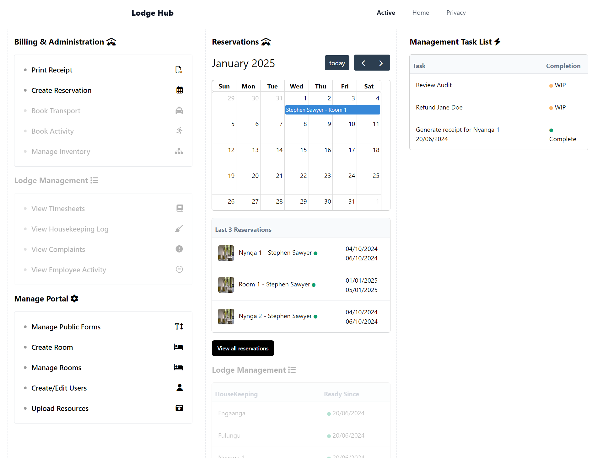
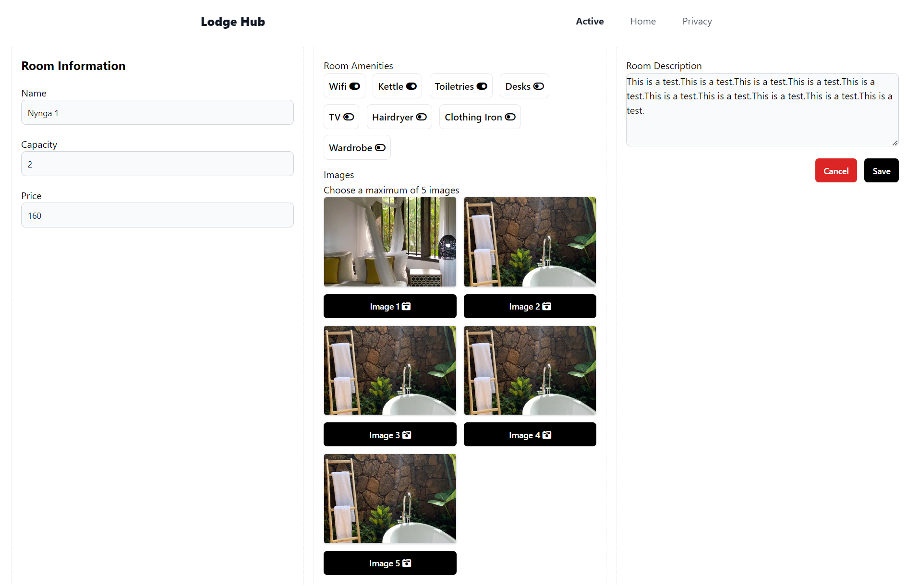
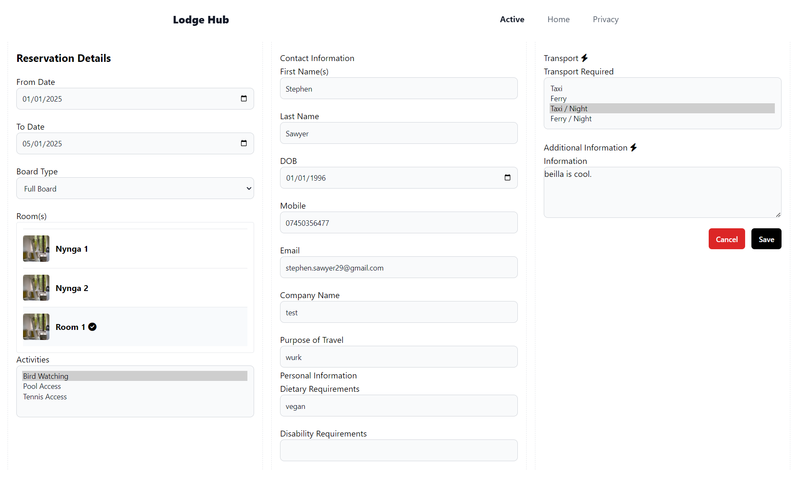
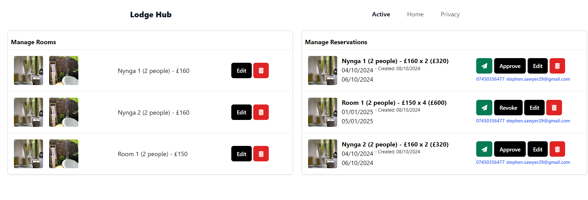
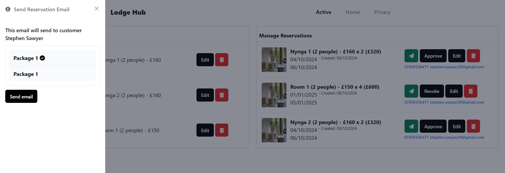

# Lodge Hub

### About
Lodge Hub is a PMS (property management system) built in ASP.NET Core MVC, which focuses on digitizing and automating business. The birth of this project began after meeting my partner and becoming involved with their lodge in Uganda. The idea is to take some of the load from the lodge, while trialing the software to then become something I can whitelabel and market as SAAS.

### Home
Common actions are group into relative sections. The first thing a lodge owner wants to see is bookings. Which is why the calendar is right at the top in the middle. The calendar shows active bookings with a click through, to ensure ease of use.

### Edit Room
This screen allows you to make adjustments to already created rooms. The form is shared, and is used as the "add new room" actions.

### Edit Reservation
This screen allows you to view details of created reservations. The add/edit reservation actions are also a shared form.

### Manage
This is an important part of the site, as it allows you to review and manage quickly.

### Email Packages
This is an email package action. Email packages are predefined emails, that allow client data to be embedded to the content. As well as attachments. Some examples would be welcome packages, or booking comformation.

