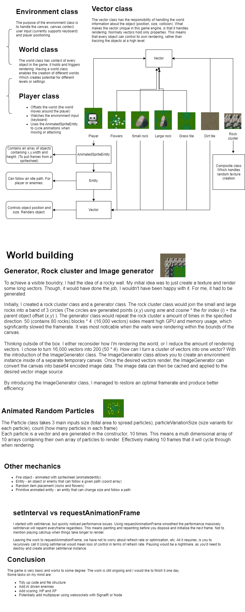

### JavaScript Canvas Game Engine

This project is a top-down 2D game engine, with the idea of becoming a wave defense game. The engine is structured in a way that every object is a recognisable vector. The most exciting part of this project is that the scenery and object placement are dynamic; different every time.

## Play (https://test1.sawyerdigital.co.uk/)

